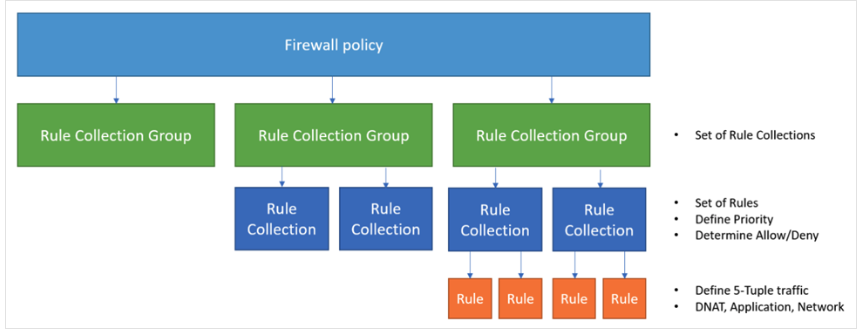

<!-- BEGIN_TF_DOCS -->


## Overview
This module creates a new Rule Collection Group for an Azure Firewall Policy.
- Rule Collection Groups form a key part of managing Firewall rules when managing policies using Firewall manager.
- Rule Collection Groups reside within a Firewall Policy.
- Rule Collections reside within a Rule Collection group
- Rules reside within the Rule Collection.



This module creates the Rule Collection Group, the Rule Collection and the rules within.

For further details on this approach, please review the official MS documentation (HERE[https://learn.microsoft.com/en-us/azure/firewall/policy-rule-sets]).


## Possible ways to manage Azure Firewall Policy

There are different ways to manage Azure Firewall Rule Collection Groups with Terraform (or any IaC for that matter). One way is to lump everything into a single (mono) repo, under a single policy. 
The problem with this approach is that the rule base soon becomes monstrously large. Processing takes longer with each new rule. Over time, the repo becomes unwieldly, with thousands of lines in a single file.

The other way is to treat each Rule Collection Group as a single state. Maybe as part of an application deployment. 
One of the advantages of this is that each application has its own Rule Colelction group, and as the Collection Group is deployed with the app, it follows the same lifecycle.
When a `terraform destroy` is run for the app, the firewall Rule Collection Group is destroyed with it. 
This helps Firewall management as rules that are obsolete, get decomissioned at the same time as the app. How many times have Firewall rules got clogged up with obsolte rules, that everyone is too afraid to remove becasue 'no one knows if it's needed'.

As with all deployments, the exact way to use this module depends on your own set of requirements. If one team is 100% respobnsible for all Firewall Rules, then a mono-repo may work fine.
If you're trying to shift app teams to be responsible for their own rules (maybe with PR review by a NetSec team), then creating Rule Collection groups with the application infrastructure deployment can be a good option.

*readme automatically generated using terraform-docs*

## Example - create a new rule collection group in an existing Azure Firewall Policy.
```hcl
  


module "new_rule_collection_group" {
  source = "../.."

  name                           = "simple_example"
  priority                       = 100
  firewall_policy_name           = "default_fw_policy"
  firewall_policy_resource_group = "rg-firewall-01"
  
  network_rule_collections = {
    name     = "rule_collection_group_demo"
    action   = "Allow"
    priority = 10
    rules = [
      {
        name                  = "demo_rule_1"
        description           = "Example Rule within a new net rule colelction group."
        source_ip_groups      = ["ipg-demo"]
        destination_ip_groups = ["ipg-demo-dst"]
        destination_ports     = ["443"]
        protocols             = ["TCP"]
      },
      {
        name                  = "demo_rule_2"
        description           = "A second rule within the new net rule collection group."
        source_addresses      = ["10.0.0.0/24"]
        destination_ip_groups = ["ipg-web"]
        destination_ports     = ["443", "80"]
        protocols             = ["TCP"]
      }
    ]
  }

}
```

## Inputs

| Name | Description | Type | Default | Required |
|------|-------------|------|---------|:--------:|
| <a name="input_application_rule_collections"></a> [application\_rule\_collections](#input\_application\_rule\_collections) | n/a | <pre>list(object({<br>    name     = string<br>    action   = string<br>    priority = number<br>    rules = optional(list(object({<br>      name        = string<br>      description = optional(string, null)<br>      protocols = object({<br>        type = string # "http" or "https"<br>        port = number<br>      })<br>      source_addresses = optional(list(string))<br>      source_ip_groups = optional(list(string))<br>      destination_fqdn_tags = optional(list(string))<br>      destination_fqdns = optional(list(string))<br>      destination_urls = optional(list(string))<br>      destination_addresses = optional(list(string))<br>    })))<br>  }))</pre> | `[]` | no |
| <a name="input_firewall_policy_name"></a> [firewall\_policy\_name](#input\_firewall\_policy\_name) | The name of the firewall policy where the new Rule Collection Group will be created. | `string` | n/a | yes |
| <a name="input_firewall_policy_resource_group"></a> [firewall\_policy\_resource\_group](#input\_firewall\_policy\_resource\_group) | The name of the Resource Group where the Firewall policy resides. | `string` | n/a | yes |
| <a name="input_name"></a> [name](#input\_name) | The name to assign to the new Rule Collection Group | `string` | n/a | yes |
| <a name="input_network_rule_collections"></a> [network\_rule\_collections](#input\_network\_rule\_collections) | n/a | <pre>list(object({<br>    name     = string<br>    action   = string<br>    priority = number<br>    rules = optional(list(object({<br>      name                  = string<br>      description           = optional(string, null)<br>      protocols             = list(string)<br>      source_addresses      = optional(list(string))<br>      source_ip_groups      = optional(list(string))<br>      destination_ports     = list(number)<br>      destination_fqdns     = optional(list(string))<br>      destination_ip_groups = optional(list(string))<br>      destination_addresses = optional(list(string))<br>    })))<br>  }))</pre> | `[]` | no |
| <a name="input_priority"></a> [priority](#input\_priority) | The Priority to assign to the new Rule Collection Group being created. | `number` | n/a | yes |

## Outputs

| Name | Description |
|------|-------------|
| <a name="output_rule_collection_group_id"></a> [rule\_collection\_group\_id](#output\_rule\_collection\_group\_id) | n/a |
| <a name="output_rule_collection_group_name"></a> [rule\_collection\_group\_name](#output\_rule\_collection\_group\_name) | n/a |
| <a name="output_rule_collection_group_priority"></a> [rule\_collection\_group\_priority](#output\_rule\_collection\_group\_priority) | n/a |  
<!-- END_TF_DOCS -->